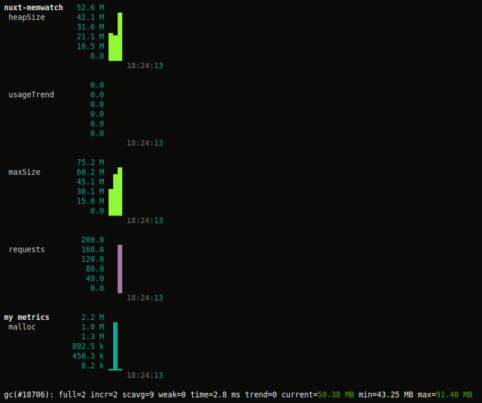

# Quickly watch real-time memory stats of your nuxt app
[](https://www.npmjs.com/package/nuxt-memwatch)
[](https://www.npmjs.com/package/nuxt-memwatch)

## Introduction

This module gives you better insights in the heap usages of your nuxt server. Especially when using the node-memwatch peer dependency it can be used to help track down memory leaks. This module uses [node-memwatcher](https://github.com/pimlie/node-memwatcher) and [node-memwatch](https://github.com/airbnb/node-memwatch), see their readme's for more information

Allthough other tools may provide the same or better functionality, this module is probably the quickest.

<p align="center"></p>

## Setup
> :information_source: Please note you dont need to re-build your project when en-/disabling this module, you only need to restart the server

##### Install
```
npm install --save nuxt-memwatch
// or
yarn add nuxt-memwatch
```

##### Install the node-memwatcher peer dependency (recommended)
```
npm install --save @airbnb/node-memwatch
// or
yarn add @airbnb/node-memwatch
```

##### Add `nuxt-memwatch` to `modules` section of `nuxt.config.js`
```js
  modules: [
    ['nuxt-memwatch', { averages: true }],
  ]
```
or 
```js
  modules: [
    'nuxt-memwatch'
  ],
  memwatch: {
    graph: true,
    graphSetup(setup) {
      setup.metrics.malloc = {
        aggregator: 'avg',
        color: 'cyan'
      }
    },
    graphAddMetric(turtleGraph, stats) {
      turtleGraph.metric('my metrics', 'malloc').push(stats.malloced_memory)
    }
  }
```

## Example

You can run the included example by cloning this repo, run `yarn install && yarn build` and finally `yarn start`. Then generate some requests by running `ab -c100 -n100000 http://127.0.0.1:3000/`, this example uses max ~1.3GB of memory which is fine-tuned for node's default heap size limit of 1.5GB (more specifically, 1.5GB is the default limit of the old space)

## Running in development mode

Nuxt is not running (memory) 'optimised' in development mode. Memory leaks are likely so although its' possible to use this module in development mode it is not recommended.

## FAQ

Please check the [node-memwatcher FAQ](https://github.com/pimlie/node-memwatcher/wiki/FAQ)

## Module Options

Besides the default [node-memwatcher options](https://github.com/pimlie/node-memwatcher#options), this module provides some extra options

#### `gcAfterEvery` _number_ (0)

If set to a number larger then 0, we will force the gc to run after this number of requests. E.g. when set to 1 the gc runs after every request

> :fire: This only works when you have either installed the peer dependency or are running node with `--expose_gc`

#### `nuxtHook` _string_ (listen)

Memory leaks and heap usages are probably mostly interesting when the nuxt server is running and serving requests. Therefore we start listening for stats events on the listen hook, unless you are running this module in development mode, then we listen for `build:done` instead (when you havent change this value). If e.g you would like to debug `nuxt generate` you could do:

```js
// nuxt.config.js

import { getMemwatch } from 'node-memwatcher'
let memwatch

export default {
  ...
  memwatch: {
    graph: false,
    nuxtHook: 'generate:before'
  },
  hooks: {
    generate: {
      async before() {
        memwatch = await getMemwatch()
      },
      routeCreated() {
        // this probably wont work as you expect
        // as node/v8 will probably be too busy to run the gc
        // but more importantly there is not really a nuxt hook
        // available to do this in the right place
        // This does work however, but the gc call at route `n`
        // can only clear memory usage by previous routes `< n`
        memwatch.gc()
      }
    }
  }
  ...
```